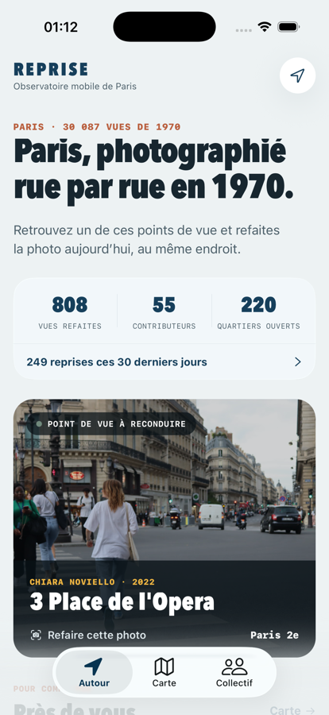
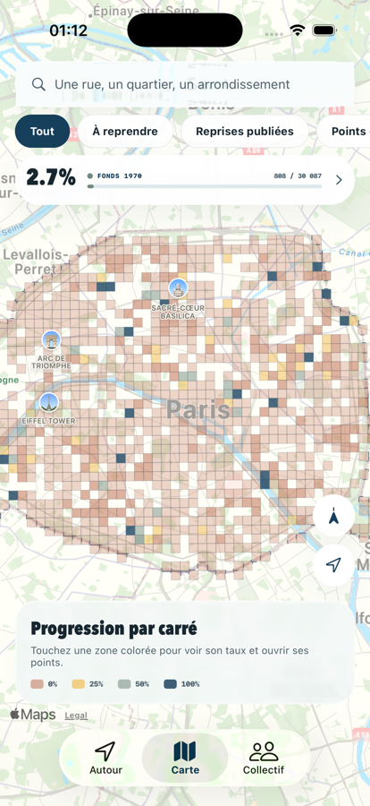
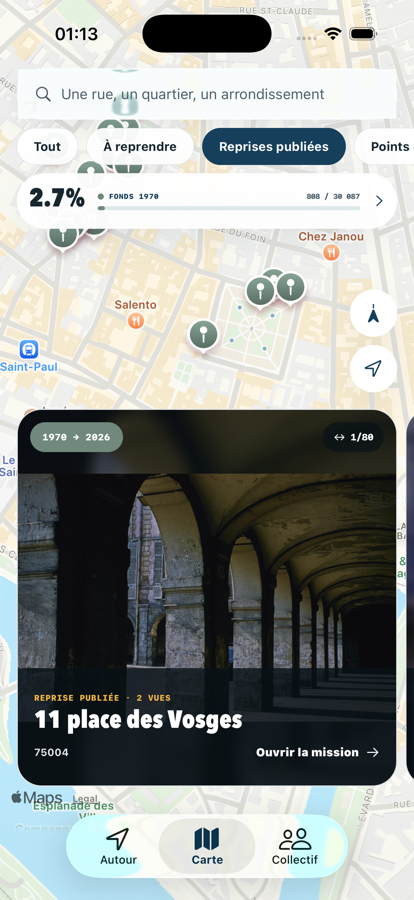
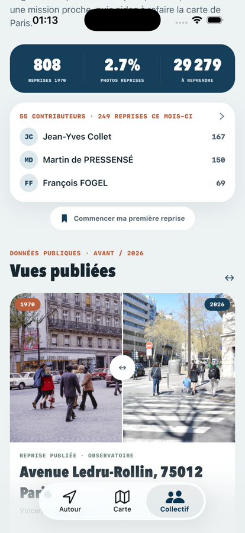

# Reprise

Application mobile gratuite pour retrouver les points de vue photographiques de Paris et les
reconduire aujourd'hui.

En 1970, la FNAC et la Ville de Paris organisent un concours amateur d'une ampleur inédite :
Paris est découpé en carrés de 250 m, et 2 800 photographes en rapportent des dizaines de
milliers d'images, aujourd'hui conservées par la Bibliothèque historique de la Ville de Paris.
Reprise vous aide à retrouver ces points de vue, à caler le cadrage avec la caméra du téléphone,
et à comparer les deux époques.

Le projet accompagne la campagne de l'[Observatoire photo participatif des paysages
parisiens](https://observatoire-photo.paris/), animée par le CAUE de Paris.

| | | | |
|:-:|:-:|:-:|:-:|
|  |  |  |  |
| Les points de vue autour de vous | Les 1 755 carrés historiques | Les reprises déjà publiées | Le collectif et ses comparaisons |

## Développement

```bash
npm install
npx expo run:ios --device
```

Un development build est nécessaire : l'app utilise `react-native-maps`, `expo-camera`,
`expo-media-library` et `expo-glass-effect`, qui ne sont pas disponibles dans Expo Go.

### Vérifications locales

La CI des pull requests exécute les mêmes commandes, avec une installation strictement issue du
lockfile et sans build natif :

```bash
npm ci
npx tsc --noEmit
npm run lint
npm test -- --runInBand
npx expo export --platform ios --no-bytecode --output-dir /tmp/reprise-ios-export
```

Les tests Jest couvrent en priorité la persistance du carnet, le bridge du formulaire officiel,
la validation du snapshot et les utilitaires purs. L'export vérifie le bundle JavaScript iOS ; il
ne remplace pas une validation sur iPhone ni un build EAS.

Sur Android, Google Maps requiert une clé native. La vraie valeur reste dans `.env.local` en local
et dans les variables d’environnement EAS pour les builds distants :

```bash
cp .env.example .env.local
# renseigner GOOGLE_MAPS_API_KEY dans .env.local
```

Pour tester le préremplissage, le sélecteur de photos de la WebView et son écran de confirmation
sans envoyer de contribution réelle — notamment si le serveur officiel est indisponible — lancer
Metro avec la fixture réservée au mode développement :

```bash
EXPO_PUBLIC_OFFICIAL_SUBMISSION_FIXTURE=1 npx expo start --dev-client --clear
```

La fixture affiche explicitement « TEST LOCAL », ne fait aucune requête et ne peut pas être activée
dans un build de production.

### Captures App Store

L’éditeur des captures marketing iPhone vit dans un projet séparé afin de ne pas mélanger ses
dépendances Next.js avec l’application Expo :

```bash
cd store-screenshots
pnpm install
pnpm dev
```

Ouvrir ensuite `http://localhost:3000`. La composition et les textes sont enregistrés dans
`store-screenshots/app-store-screenshots.json`; le bouton **Export bundle** génère les PNG pour
les tailles iPhone prises en charge.

## Les données

L'app n'interroge jamais l'API de l'Observatoire à l'exécution. Un script produit un relevé
normalisé, embarqué dans le bundle :

```bash
node scripts/ingest-observatoire.mjs
```

Ce relevé est régénéré chaque nuit par une action planifiée et publié dans ce dépôt. L'app le
télécharge au lancement, avec repli sur la copie embarquée : elle reste utilisable hors connexion
et n'a pas besoin d'une mise à jour App Store pour rafraîchir ses chiffres.

Trois raisons à ce choix. L'API amont est servie sans CDN ni compression et en
`cache-control: private`, une ouverture coûtait 4,5 Mo ; la campagne se termine le 30 novembre
2026 et l'endpoint peut évoluer ; enfin les clés du formulaire sont auto-générées, un champ
renommé côté serveur casserait une app déjà publiée.

Le script filtre les champs par liste blanche et refuse d'écrire si une adresse e-mail survit.
Le même contrôle est rejoué en intégration continue avant publication.

Les auteurs et les lieux des dossiers de 1970 proviennent des notices BHVP normalisées par le
projet [paris-1970](https://framagit.org/dohseven/paris-1970). Seul un index de
métadonnées de moins de 300 Ko est versionné ; aucune de ses copies d'images n'est embarquée.
Pour reconstruire cet index depuis un clone local :

```bash
npm run data:import-paris1970 -- /chemin/vers/paris-1970
```

## Sources et licences

**Données de l'Observatoire** : © les contributrices et contributeurs de l'Observatoire photo
participatif des paysages parisiens, animé par le CAUE de Paris. Le règlement de participation ne
place ces contributions sous aucune licence publique : ses articles 10.1 et 10.2 prévoient une
autorisation gratuite et non commerciale au bénéfice du seul CAUE de Paris et de la Ville de
Paris, nommés limitativement. Reprise n'en est pas bénéficiaire et ne revendique aucun droit de
rediffusion. Les prénoms et noms sont affichés au titre de l'attribution, conformément à
l'article 10.3 du règlement. Aucune autre donnée personnelle n'est reprise.

La seule mention ODbL de la plateforme concerne le fond de carte OpenStreetMap, pas les
photographies ni la base de l'Observatoire.

**Grille de 1970** : découpage officiel du concours, exporté en WGS84 par le CAUE de Paris.

**Photographies de 1970** : fonds « C'était Paris en 1970 », conservé par la Bibliothèque
historique de la Ville de Paris. Elles restent sous le droit d'auteur de leurs auteurs : la clause
d'abandon des droits a été retirée du règlement du concours, et aucune cession à la Ville de Paris
n'est documentée. Elles ne sont pas embarquées dans l'application, qui les charge depuis la
visionneuse de la BHVP à partir de leurs permaliens ARK et affiche le nom du photographe, la BHVP
et le nom du fonds. Les lieux visibles dans l'app sont les lieux indexés par la BHVP à partir des
légendes des dossiers ; ils ne sont pas présentés comme une identification certaine de chaque vue.

**Reproduction lors d'un dépôt** : au moment de contribuer, l'application téléverse une copie de
la photographie d'archive dans le formulaire officiel, comme l'exige le mode d'emploi de
l'Observatoire. Cette reproduction ne fait à ce jour l'objet d'aucune autorisation écrite de la
BHVP ni du CAUE.

## Publication

Le [site public](https://youplala.github.io/reprise/) réunit la politique de confidentialité,
l’assistance, les conditions d’utilisation et les sources. Ces URLs sont utilisées par App Store
Connect et Play Console.

La clé Google Maps Android ne doit jamais être commitée. Pour un build distant, créer la variable
`GOOGLE_MAPS_API_KEY` dans l’environnement EAS `production`; le build Android de production est
volontairement bloqué si elle manque.

L'identifiant Apple utilisé pour la soumission n'est pas versionné. Il se fournit par
l'environnement :

```bash
export EXPO_APPLE_ID="votre@adresse"
eas build --platform ios --profile production --auto-submit
```

## Licence

Le code est publié sous licence MIT (voir `LICENSE`). Les données et les photographies relèvent
des licences indiquées ci-dessus.
